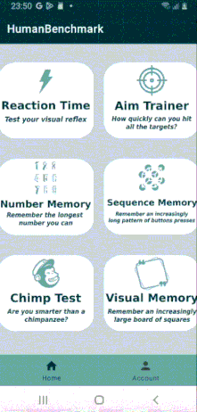

# HumanBenchmark

  

Reaction Time

 

  
  
  

  

AIM Trainer

 

  
  
  

  

Number Memory

 

  
  
  

  

Sequence memory

 

  
  
  

  

Chimp Test

 

  
  
  

  

Visual Memory

 

  
  
  

